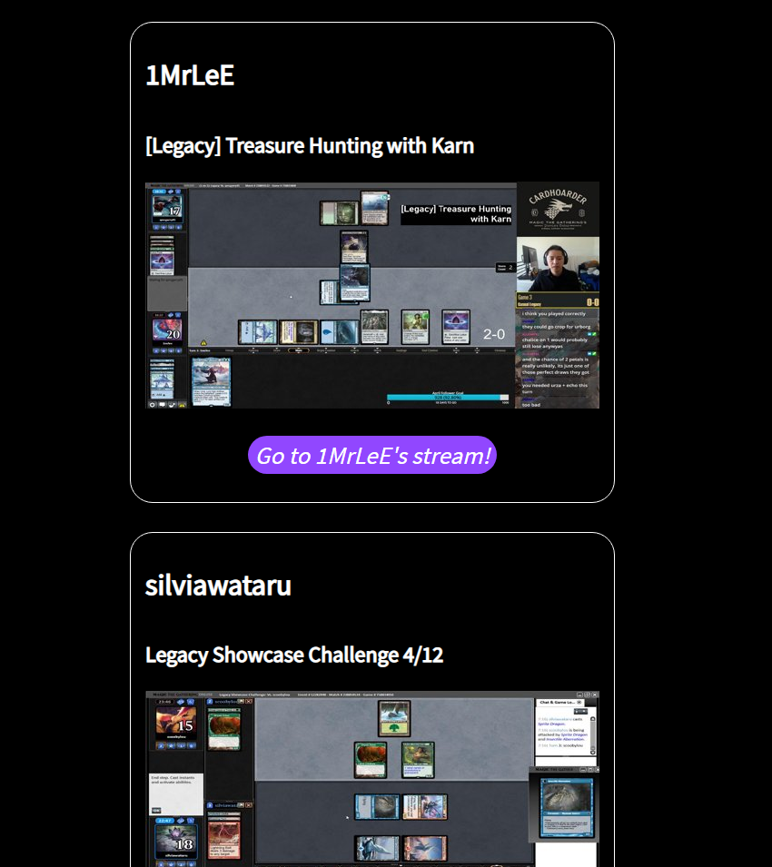

# :tv: Twitch M:tG Legacy Finder

## :memo: Description
Do you like watching Magic: the Gathing streams on Twitch.tv? Specifically streams of the Legacy format?

So do I! And that's why i built this tool. Since Arena became a popular way for Magic players to stream Magic, I have a hard time filtering out all the arena and modern streams on Twitch.

This website shows only the live M:tG streams with `legacy` in the title.

## :question: Why do I need to login to Twitch?

Since this is a client side application, Twitch's API requires an access token in order to access certain endpoints. I wanted to avoid writing a server for this little project, so you'll need to login. Sorry for any inconvenience.

Note: I am not storing ANY of your data. There is no database attached to this website.

## :robot: Technologies used

- Twitch's API
- `create-react-app`
- GitHub pages
- custom CSS

## :envelope: Contact

If you find any bugs or have any suggestions, feel free to open an issue or DM here on GitHub. You can also find me on twitter [@CobyPear](https://twitter.com/cobypear)